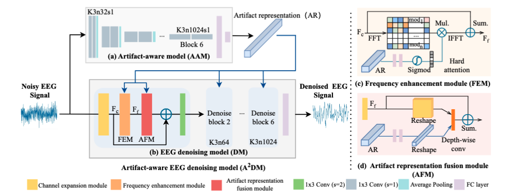

# $A^2DM$: Enhancing EEG artifact removal by fusing artifact representation into the time-frequency domain

## This is the Official PyTorch implementation of our Cognitive Computation paper "$A^2DM$: Enhancing EEG artifact removal by fusing artifact representation into the time-frequency domain".




## Usage

### Generate Pretraining Data

In our model, we first construct a pretraining dataset to generate artifact representations. We use the code from https://github.com/ncclabsustech/EEGdenoiseNet to generate EEG signal segments with artifacts of different signal-to-noise ratios and artifact types. Labels are created based on the corresponding artifact data, and a classification task is used to train the model (the input is EEG segments with artifacts, and the output is the artifact representation). The network structure is in the file `Classifier_network_base.py`.

**We recommend retraining the artifact representation module according to your specific task.**

The data and model files are available in the `Releases` section and can be accessed directly.

### Generate Artifact Removal Dataset

Similarly, we use the code from https://github.com/ncclabsustech/EEGdenoiseNet to generate the artifact-removed dataset for training the model (the input is EEG segments with artifacts, and the output is the artifact-removed EEG segments).

## Quick Test

We provide the test set used in our study (`test_input.npy` and `test_output.npy`) and the pretrained model (`basemodel_84_75.692.pth`).

You can directly run the test using:

```bash
python eval_all.py
```

## Reference

[EEGdenoiseNet](https://github.com/ncclabsustech/EEGdenoiseNet)

---


